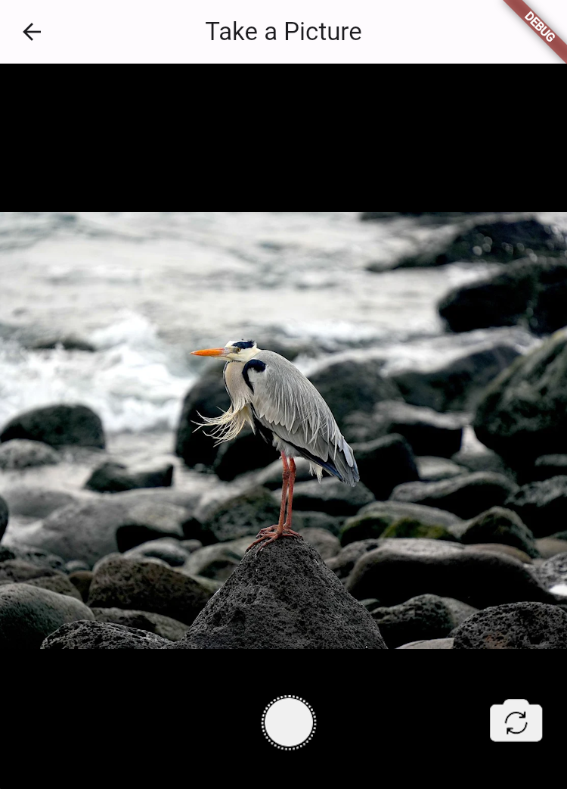

# Simple Web Camera

A Flutter package that provides a simple widget to access and take photos using
the browser's camera functionality. This package is specifically designed for
web applications and returns the captured photo as a base64 encoded string.



## Features

- Easy to integrate camera access and photo capture functionality for Flutter
  web apps.
- Returns a base64 encoded string of the captured image, ready to be used within
  your application.
- Customizable AppBar title and the option to center the title.
- Camera switching capability allows users to switch between multiple cameras.
  The switch camera button is intelligently shown only when more than one camera
  is available, enhancing the user interface and experience.

## Getting Started

To use this package, add `simple_web_camera` as a dependency in your
`pubspec.yaml` file.

```yaml
dependencies:
  flutter:
    sdk: flutter
  simple_web_camera: ^latest_version
```

## Usage

Here is a simple example to demonstrate how to use the `SimpleWebCameraPage`
widget to capture a photo:

```dart
import 'dart:convert';
import 'package:flutter/material.dart';
import 'package:simple_web_camera/simple_web_camera.dart';

void main() {
  runApp(const MainApp());
}

class MainApp extends StatelessWidget {
  const MainApp({Key? key}) : super(key: key);

  @override
  Widget build(BuildContext context) {
    return MaterialApp(
      title: "Simple Web Camera Example",
      theme: ThemeData(
        primarySwatch: Colors.blue,
      ),
      home: const HomePage(),
    );
  }
}

class HomePage extends StatefulWidget {
  const HomePage({Key? key}) : super(key: key);

  @override
  State<HomePage> createState() => _HomePageState();
}

class _HomePageState extends State<HomePage> {
  String result = '';

  @override
  Widget build(BuildContext context) {
    return Scaffold(
      body: Center(
        child: Column(
          mainAxisSize: MainAxisSize.min,
          children: [
            ElevatedButton(
              onPressed: () async {
                var res = await Navigator.push(
                  context,
                  MaterialPageRoute(
                    builder: (context) => const SimpleWebCameraPage(
                        appBarTitle: "Take a Picture", centerTitle: true),
                  ),
                );
                setState(() {
                  if (res is String) {
                    result = res;
                  }
                });
              },
              child: const Text("Take a picture"),
            ),
            const SizedBox(height: 16),
            const Text("Picture taken:"),
            if (result.isNotEmpty)
              Center(
                child: SizedBox(
                  width: 200, // Example width
                  height: 200, // Example height
                  child: Image.memory(
                    base64Decode(result),
                  ),
                ),
              ),
          ],
        ),
      ),
    );
  }
}
```

## Displaying the Captured Image

The returned base64 encoded image string can be displayed using the
`Image.memory` widget as shown in the example above.

## Contribution

Contributions are welcome! If you find any issues or have suggestions for
improvements, please feel free to submit an issue or a pull request.

## License

This package is licensed under the
[MIT license](https://opensource.org/licenses/MIT).
